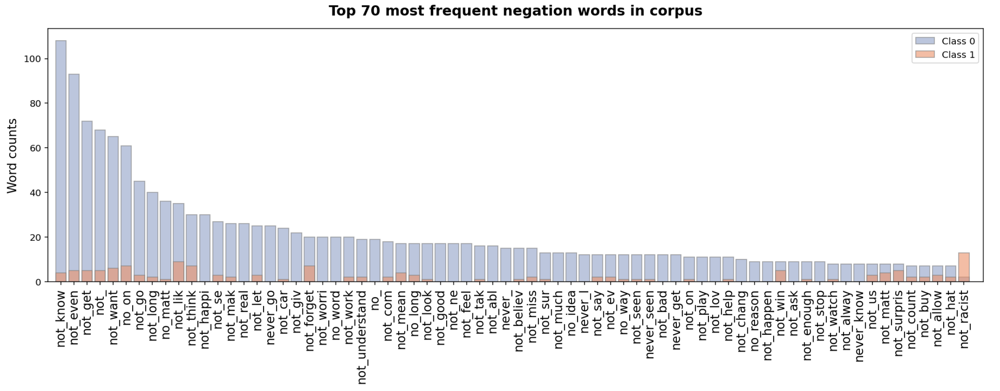
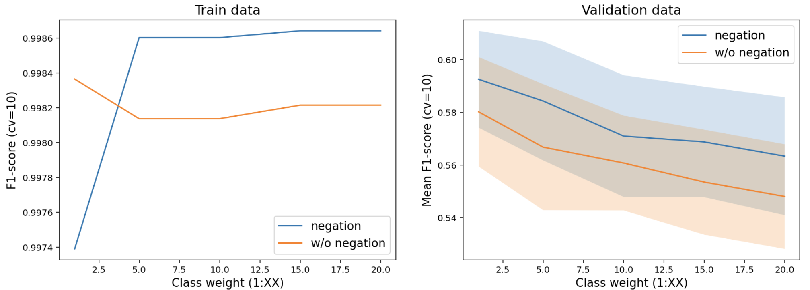
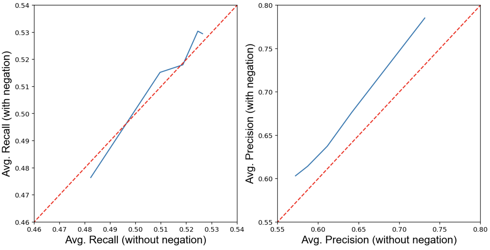
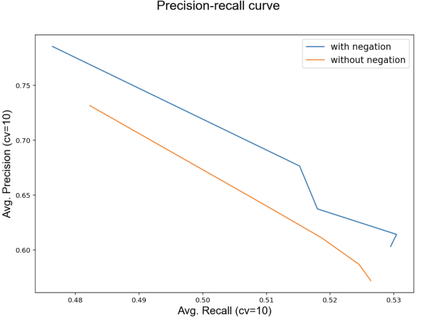

# Negation analysis for improved sentiment prediction

#### Motivation

Stop words are words that are essential for a sentence to make sense, such as: “I”, “the”, “and”, etc. The issue with stop words is that they are very *frequent* and *uninformative*. So, it is suitable for most NLP applications to remove them from the text. 

Common NLP libraries (e.g., NLTK, spaCy, scikit-learn, etc.) provide pre-compiled lists of stop words. These lists include a few negation words such as: 
- `no`, `nor`, `not`
- `do`, `don't`, `didn't`, `wouldn't`.

However, removing negation words from the text may be undesirable for some tasks, such as sentiment analysis. For example, if we use these lists to remove stopwords from our text, then sentences such as: `"I don't like this movie"`, will become `"like this movie"`. We see that the cleaned sentence conveys the opposite sentiment from the original sentence! I would like to investigate to what extend this may have a negative effect on the performance of sentiment (text) classifiers.

#### My goals

In this notebook, I would like to:
* clean the text so that the negation words aren't removed. 
* work around incompatibilities between NLTK's stopwords list, stemmers and tokenizers.
* investigate whether keeping negation words in the text helps to improve the performance of text classifiers.

I've tested this approach on the Hate-Speech dataset (class-imbalance: 93% - 7%). 

The effect on model performance was investigated using the f1-score with cross-validation (cv=10). I've also investigated the effect of the `class_weight` parameter on model performance. 

The results show that, on average, the model with negation performs sightly better than the model without negation. This is due to an improvement in the precision rate.

